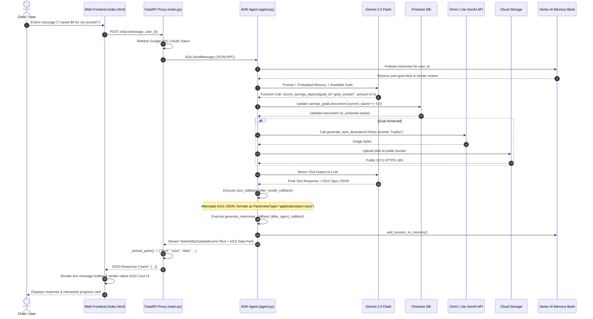

# MoneySprout: Technical Architecture & System Specification

## 1. Executive Summary & System Overview

**MoneySprout** is an autonomous, interactive financial literacy and discipline agent designed to teach children healthy money habits, financial discipline, delayed gratification, needs vs. wants evaluation, and polite money etiquette.

Built on Google's **Agent Development Kit (ADK)** and targeting **Agent Runtime 1.1.0 (GA)**, MoneySprout combines multi-turn conversational AI, generative multimodal media, real-time database management, grounded retrieval (RAG), persistent cross-session memory, and native UI component rendering (**A2UI**).

```
+-----------------------------------------------------------------------------------+
|                                   MONEYSPROUT                                     |
|               Interactive Kids Financial Habits & Discipline Agent                 |
+-----------------------------------------------------------------------------------+
|  * ReAct Conversational Engine (Gemini 2.5 Flash)                                 |
|  * Generative Multimodal Studio (Gemini Omni Flash Video & Gemini 3.1 Flash Image)  |
|  * Persistent Cross-Session Memory (Vertex AI Memory Bank)                        |
|  * Grounded Guardrails & Safety (Serverless Vertex AI RAG Engine)                 |
|  * Real-Time State & Ledger (Google Cloud Firestore - 6 Collections)              |
|  * Interactive UI Protocol (A2UI v0.8 Native Card Rendering)                      |
|  * Agent Interoperability Protocol (A2A JSON-RPC / HTTP Streaming)                |
+-----------------------------------------------------------------------------------+
```

---

## 2. Technology Stack & Component Matrix

| Layer / Subsystem | Technology / Service | Version / Model | Role & Purpose |
| :--- | :--- | :--- | :--- |
| **Agent Framework** | `google-adk` / `google-agents-cli` | v1.1.0 | Core agent runtime, tool registration, ReAct orchestration, runner lifecycle. |
| **Primary LLM** | Google Gemini | `gemini-2.5-flash` | Intent understanding, tool dispatch, educational reasoning, and response generation. |
| **Video Generation** | Google Gemini Omni | `gemini-omni-flash-preview` | Text-to-video generation for 5-second educational concept animations. |
| **Image Generation** | Google Gemini Vision/Image | `gemini-3.1-flash-lite-image` | Generative vector-style illustrations for goals, trophies, and reward badges. |
| **Document RAG** | Vertex AI RAG Engine | Serverless (`us-central1`) | RAG corpus grounding child safety, COPPA privacy, and financial etiquette principles. |
| **Long-Term Memory** | Vertex AI Memory Bank | Managed ADK Memory Service | Cross-session memory persistence for child progress, savings goals, and streaks. |
| **Database** | Google Cloud Firestore | NoSQL Document Store | Real-time state persistence across 6 collections (Goals, Chores, Ledger, Streaks, etc.). |
| **Media Storage** | Google Cloud Storage (GCS) | Standard Bucket | Public storage for generated videos, goal illustrations, and PIL reward certificates. |
| **UI Protocol** | A2UI (Agent-to-User UI) | v0.8 (BasicCatalog) | Generates declarative JSON UI schemas rendered as native interactive cards in browser. |
| **Agent Protocol** | A2A Protocol | Standard A2A v1 | Agent-to-Agent communication, context tracking, and task artifact streaming. |
| **Frontend Proxy** | FastAPI + Uvicorn | Python 3.11+ | Middle-layer Web Proxy handling ADC authentication, A2A streaming, and dashboard API. |
| **Web Interface** | HTML5 / Vanilla CSS / JS | Modern Dark Theme | Single-page application with chat UI, native A2UI renderer, and live Firestore telemetry. |
| **External APIs** | QuickChart API & Pillow (PIL) | REST / Python | Dynamic radial gauge certificate generation and custom PNG certificate image rendering. |

---

## 3. Logical System Architecture

The logical architecture separates concerns into five distinct tiers: Client Interface, Web & Authentication Proxy, ADK Agent Runtime Core, Cloud Data & Intelligence Services, and Generative Multimodal Pipeline.

```mermaid
graph TD
    subgraph Client Tier
        UI["Single Page Web App (index.html)<br/>• Chat UI & A2UI Renderer<br/>• Live Telemetry Dashboard"]
    end

    subgraph Proxy & Gateway Tier
        Proxy["FastAPI Frontend Proxy (main.py)<br/>• Port 8080<br/>• ADC Credential Refresh<br/>• /chat A2A Handler<br/>• /api/dashboard Endpoint"]
    end

    subgraph Agent Runtime Tier (Cloud Run / Container)
        AgentServer["FastAPI Agent Container (fast_api_app.py)<br/>• Port 8000<br/>• ADK Runner Lifecycle<br/>• A2A Protocol RPC Endpoint"]
        AgentCore["Root Agent (agent.py)<br/>• Gemini 2.5 Flash Model<br/>• ReAct Loop<br/>• 21 Function Tools"]
        Callbacks["Callback Engine<br/>• a2ui_callback (after_model)<br/>• generate_memories_callback (after_agent)"]
    end

    subgraph Grounding & Memory Services
        RAG["Vertex AI RAG Engine<br/>• Guardrails & Etiquette Corpus"]
        MemBank["Vertex AI Memory Bank<br/>• PreloadMemoryTool<br/>• Long-Term Fact Store"]
    end

    subgraph Persistence & Asset Services
        Firestore[("Google Cloud Firestore<br/>• 6 Core Collections")]
        GCS[("Google Cloud Storage<br/>• Media Bucket")]
    end

    subgraph Multimodal & External Generators
        OmniVideo["Gemini Omni API<br/>(gemini-omni-flash-preview)"]
        LiteImage["Gemini Image API<br/>(gemini-3.1-flash-lite-image)"]
        PillowCanvas["Pillow (PIL) Canvas<br/>• Certificate PNG Render"]
        QuickChart["QuickChart API<br/>• Gauge Badge Render"]
    end

    %% Flow Connections
    UI -->|HTTPS / JSON / SSE| Proxy
    Proxy -->|A2A Protocol + Bearer Token| AgentServer
    AgentServer --> AgentCore
    AgentCore --> Callbacks
    
    AgentCore -->|Query Guardrails| RAG
    AgentCore -->|Recall/Save Memories| MemBank
    AgentCore -->|CRUD Operations| Firestore
    
    AgentCore -->|Text-to-Video Prompt| OmniVideo
    AgentCore -->|Text-to-Image Prompt| LiteImage
    AgentCore -->|Draw PNG Certificate| PillowCanvas
    AgentCore -->|Generate Gauge URL| QuickChart

    OmniVideo -->|Upload MP4| GCS
    LiteImage -->|Upload PNG/JPG| GCS
    PillowCanvas -->|Upload PNG| GCS

    Proxy -->|Read Telemetry| Firestore
```

---

## 4. Technical Sequence & Data Flow Diagram

The following sequence details an end-to-end user message execution, including tool dispatch, database updating, multimodal media generation, callback processing, and A2UI card streaming.



---

## 5. Data Models & Database Schemas

MoneySprout utilizes **Google Cloud Firestore** as its core document database. The system maintains six primary collections:

```
Firestore Database: (default)
├── savings_goals/                       [Document ID: goal_id]
├── chores_and_allowance/                [Document ID: chore_id]
├── delayed_gratification_waiting_room/  [Document ID: wishlist_id]
├── ledger_transactions/                 [Document ID: transaction_id]
├── discipline_and_etiquette_streaks/   [Document ID: habit_id]
└── badges_and_achievements/            [Document ID: badge_id]
```

### 5.1 Collection: `savings_goals`
Tracks target items, pricing, current savings progress, and completion state.
```json
{
  "goal_id": "goal_scooter",
  "item_name": "Outdoor Scooter",
  "category": "Want",
  "target_amount": 50.00,
  "current_saved": 35.00,
  "weekly_savings": 5.00,
  "is_achieved": false,
  "notes": "Saving $5 per week from weekend chore allowance."
}
```

### 5.2 Collection: `chores_and_allowance`
Manages household responsibilities, rewards, frequencies, and verification statuses.
```json
{
  "chore_id": "chore_clean_room",
  "title": "Clean Bedroom & Make Bed",
  "reward_amount": 3.00,
  "frequency": "Weekly",
  "status": "completed",
  "notes": "Must put away all toys and fold blanket."
}
```

### 5.3 Collection: `delayed_gratification_waiting_room`
Enforces a 7-day reflection period for impulse purchases ("Wants") before buying.
```json
{
  "wishlist_id": "wish_9a8f2b",
  "item_name": "Small Toy Robot",
  "cost": 15.00,
  "cool_off_days_left": 5,
  "status": "cooling_off",
  "notes": "Placed in waiting room to test if interest persists after 7 days."
}
```

### 5.4 Collection: `ledger_transactions`
Auditable digital piggy bank ledger recording all income, savings deposits, and spending.
```json
{
  "transaction_id": "txn_3c1d4e",
  "type": "savings_deposit",
  "amount": 5.00,
  "category": "Chore Allowance",
  "notes": "Deposited $5 into Outdoor Scooter goal."
}
```

### 5.5 Collection: `discipline_and_etiquette_streaks`
Measures consecutive days/events of financial manners, gratitude, and delayed gratification.
```json
{
  "habit_id": "etiquette_thank_you_streak",
  "habit_name": "Saying Thank You for Allowance/Gifts",
  "current_streak_days": 12,
  "best_streak_days": 14,
  "notes": "Politely expressed gratitude to grandparents for birthday gift."
}
```

### 5.6 Collection: `badges_and_achievements`
Gamified trophy system rewarding child milestones.
```json
{
  "badge_id": "badge_patience_master",
  "title": "Patience Master",
  "description": "Completed a 7-day cooling off period in the Waiting Room.",
  "icon": "⏳",
  "unlocked": true
}
```

---

## 6. Implementation Subsystem Specifications

### 6.1 Agent Logic & Tool Registry (`app/agent.py`)

The agent is instantiated as an ADK `Agent` object with 21 custom function tools and 1 system tool (`PreloadMemoryTool`).

#### Tool Categorization & Signatures:
1. **Multimodal Generation Tools**:
   - `generate_financial_concept_video(concept_description: str, tool_context: ToolContext) -> str`: Calls REST API for `gemini-omni-flash-preview` in global region. Saves MP4 artifact and uploads to GCS.
   - `generate_item_illustration(item_description: str, tool_context: ToolContext) -> str`: Uses `genai.Client(vertexai=True)` calling `gemini-3.1-flash-lite-image`. Saves PNG artifact and uploads to GCS.
2. **Grounded RAG Retrieval Tool**:
   - `consult_kids_financial_guardrails(query: str) -> str`: Queries Vertex AI RAG Corpus (`rag.retrieval_query`) for top 3 passage matches.
3. **Firestore CRUD Tools**:
   - Savings Goals: `get_savings_goals()`, `add_or_update_savings_goal()`, `record_savings_deposit()`
   - Chores & Allowance: `get_chores_and_allowance()`, `complete_chore()`
   - Delayed Gratification: `get_waiting_room_items()`, `add_to_waiting_room()`
   - Ledger Transactions: `get_ledger_history()`, `record_transaction()`
   - Etiquette & Streaks: `get_etiquette_streaks()`, `log_etiquette_event()`
   - Badges & Trophies: `get_user_badges()`
4. **Certificate & Award Tools**:
   - `generate_goal_reward_certificate(goal_id: str, child_name: str) -> str`: Renders dynamic PNG image canvas using Pillow (`PIL`), gold borders, custom fonts, uploads to GCS.
   - `generate_quickchart_savings_certificate(goal_name: str, saved_amount: float, target_amount: float) -> str`: Generates public QuickChart radial gauge URL.
5. **Financial Math & Education Helpers**:
   - `calculate_savings_timeline(target_amount: float, weekly_savings: float)`
   - `evaluate_needs_vs_wants(item_name: str, item_category: str)`
   - `get_gratitude_and_etiquette_tip(situation: str)`

---

### 6.2 A2UI Protocol Integration (`app/a2ui_utils.py` & `A2uiSchemaManager`)

MoneySprout integrates **A2UI Schema Manager v0.8** combined with `BasicCatalog.get_config("0.8")`.

```
                  +-----------------------------------+
                  |   Gemini 2.5 Flash Output JSON    |
                  +-----------------------------------+
                                    |
                                    v
                  +-----------------------------------+
                  |  a2ui_callback (after_model)      |
                  +-----------------------------------+
                                    |
                   Extracts JSON Array / JSON Object
                                    |
            +-----------------------+-----------------------+
            |                                               |
            v
    Valid A2UI Spec                                   Plain Text / Error
    Attach Part(                                      Pass through as
      data=spec,                                      standard TextPart
      mimeType="application/json+a2ui"
    )
```

#### Supported UI Components:
- **Card**: Root container element.
- **Column**: Vertical layout container.
- **Row**: Horizontal flex layout container.
- **Text**: Text rendering with `usageHint` (`h1`, `h2`, `body`).
- **Image**: Visual image container with strict HTTPS URL validation.

---

### 6.3 A2A Web Proxy & Frontend Server (`frontend/main.py`)

The Web Proxy acts as an isolation barrier between browser clients and GCP credentials.

```
+------------------+         HTTP / JSON          +---------------------+
|                  | ---------------------------> |                     |
|  Browser Client  |                              |  FastAPI Web Proxy  |
|  (index.html)    | <--------------------------- |  (frontend/main.py) |
+------------------+     SSE / JSON Responses     +---------------------+
                                                             |
                                                    Refreshes ADC Creds
                                                    `google.auth.default`
                                                             |
                                                             v
                                                  +---------------------+
                                                  |  Agent Runtime A2A  |
                                                  |  (Agent Container)  |
                                                  +---------------------+
```

#### Key Responsibilities of `main.py`:
1. **Security & Authentication**: Obtains Google Application Default Credentials (ADC) and refreshes OAuth Bearer tokens for every request.
2. **Context Management**: Maintains in-memory session mapping (`_contexts[user_id]`) ensuring multi-turn conversation memory.
3. **Stream Parsing & Extraction**: Implements `_extract_parts()`, converting raw A2A task updates into clean `{"kind": "text"}` and `{"kind": "a2ui"}` data structures.
4. **Dashboard Telemetry API**: Exposes `/api/dashboard`, fetching live collection snapshots directly from Firestore to update dashboard widgets.

---

## 7. Directory & File Structure

```
moneysprout/
├── app/                                 # Core Agent Subsystem
│   ├── agent.py                         # Root agent, prompts, 21 tools, callbacks
│   ├── a2ui_utils.py                    # A2UI callback transformer & schema specs
│   ├── fast_api_app.py                  # Agent container server (ADK & A2A routes)
│   └── app_utils/                       # Utility modules
│       ├── a2a.py                       # A2A protocol route attachers
│       ├── reasoning_engine_adapter.py  # Reasoning engine SDK adapter
│       ├── services.py                  # Session, memory, artifact service factories
│       ├── telemetry.py                 # Cloud Trace & OpenTelemetry config
│       └── typing.py                    # Data classes and pydantic models
├── frontend/                            # Web UI Subsystem
│   ├── main.py                          # FastAPI Proxy & Dashboard API
│   ├── requirements.txt                 # Web proxy dependencies
│   └── static/                          # Single-Page Web Application
│       ├── index.html                   # HTML5 Chat UI, A2UI Renderer & Dashboard
│       └── smart_kid_avatar.png         # MoneySprout visual avatar
├── docs/                                # Documentation & Guardrails
│   ├── moneysprout_guardrails_and_guidelines.txt
│   └── technical_architecture.md        # Technical architecture document
├── ARCHITECTURE.md                      # Repository root technical architecture
├── tests/                               # Test Suite
│   ├── unit/                            # Unit tests for tools and logic
│   └── integration/                     # Integration tests for agent execution
├── Dockerfile                           # Container definition for Cloud Run
├── pyproject.toml                       # Python project dependencies (uv)
└── agents-cli-manifest.yaml             # Agent Deployment Manifest
```

---

## 8. Deployment, Infrastructure & Configuration

```
+-------------------+      agents-cli deploy      +------------------------+
| Developer Workstation | -----------------------> | Cloud Build / Registry |
+-------------------+                              +------------------------+
                                                               |
                                                       Pushes Container Image
                                                               |
                                                               v
                                                   +------------------------+
                                                   | Agent Runtime 1.1.0    |
                                                   | (Cloud Run Execution)  |
                                                   +------------------------+
```

### Parameterized Environment Configuration:
- **`GCP_PROJECT_ID`**: Google Cloud Project ID (e.g. `export GCP_PROJECT_ID="your-project-id"`)
- **`GCS_BUCKET_NAME`**: Cloud Storage Bucket Name (e.g. `export GCS_BUCKET_NAME="<GCP_PROJECT_ID>-media"`)
- **`RAG_CORPUS_NAME`**: Resource path to serverless Vertex AI RAG Corpus (`projects/<PROJECT_ID>/locations/us-central1/ragCorpora/<CORPUS_ID>`)
- **`AGENT_ENGINE_RESOURCE_NAME`**: Resource path to Agent Runtime deployment (`projects/<PROJECT_ID>/locations/<LOCATION>/reasoningEngines/<ENGINE_ID>`)

### Deployment Steps:
1. **Dependency Installation**: `agents-cli install` (managed via `uv`).
2. **Local Playground Testing**: `agents-cli playground` (launches local server on port 8000).
3. **Agent Runtime Deployment**: `agents-cli deploy` (builds container and deploys to Cloud Run Agent Runtime).
4. **Gemini Enterprise Registration**: `agents-cli publish gemini-enterprise` (optional registry integration).

---

## 9. Security, Guardrails & Compliance Framework

1. **Child Privacy & Safety (COPPA Compliance)**:
   - MoneySprout operates with virtual money values and educational tracking only. No real banking credentials or payment processing APIs are connected.
   - User sessions are anonymized with session keys (`web-user` or generated UUIDs).
2. **Impulse Control Enforcement**:
   - Wants/impulse items are locked in the **7-Day Cooling Off Waiting Room**, preventing instantaneous gratification and coaching patience.
3. **RAG-Grounded Educational Guidelines**:
   - `consult_kids_financial_guardrails()` checks safety rules on every query related to privacy, money requests, or family financial etiquette.
4. **Zero Browser Credential Leakage**:
   - All Google Cloud credentials reside strictly on the server-side proxy (`frontend/main.py`). The browser interacts solely with standard HTTP endpoints.
